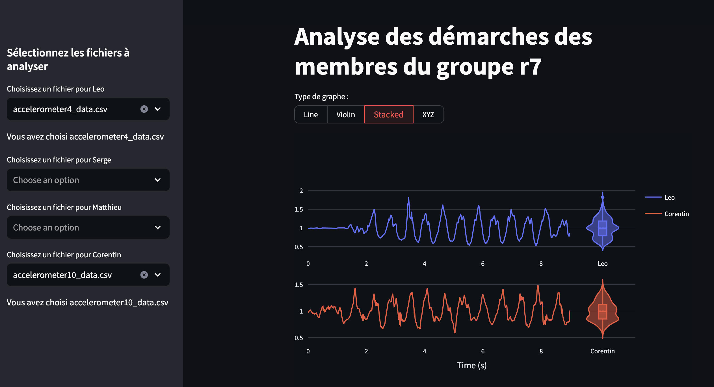

# Projet r7 : visualisation des données



## Objectif

L'objectif de ce projet est de réaliser une visualisation des données des mouvements des membres du groupe r7. Les données ont été récoltées à l'aide d'un arduino nano 33 ble sense. Nous avons pu rassembler ces données raw data dans ```data/input```. Chaque membre du groupe possède une dizaine d'enregistrements qui consistent en une marche d'environ dix secondes avec l'arduino accroché au poignet. Les données de l'accéléromètre sont enregistrées, puis on les rassemble dans ce repo.

Les données sont ensuite traitées dans le fichier ```src/formatting.py```pour être ensuite envoyées dans un fichier csv dans ```data/output```. Ces données sont ensuite utilisées pour la visualisation.

La visualisation se fait via la librairie plotly qui permet de faire des graphiques interactifs détaillés. La génération de ces graphiques se fait dans le fichier ```src/plots.py```.

Le frontend est réalisé à l'aide du framework streamlit. Le fichier ```src/main.py``` permet de lancer l'application web qui permet de visualiser les données.

L'objectif est de démontrer que l'on peut distinguer les différents membres du groupe en fonction de leur marche. Pour l'instant l'application permet de visualiser les données brutes de l'accéléromètre, mais l'objectif est de rajouter des fonctionnalités pour pouvoir distinguer les membres du groupe.

On distingue d'ores et déjà des caractéristiques dans l'amplitude et la fréquence des mouvements, ce qui est encourageant pour la suite du projet.

A terme, nous aimerions pouvoir également visualiser les données provenant de la montre empatica.

## Clonage

Pour cloner le projet, il suffit de lancer la commande suivante :

```bash
git clone https://github.com/appollo30/r7-visualization.git


## Utilisation

### Sans Docker

Pour utiliser l\'application, il faut installer les dépendances du projet. Pour cela, il faut se placer à la racine du projet et exécuter la commande suivante :

```bash
pip install -r requirements.txt
```

Ensuite, pour lancer l'application, il suffit de lancer la commande suivante :

```bash
streamlit run _👋_Accueil.py
```

Vous devriez voir apparaître un lien dans votre terminal qui vous permettra d'accéder à l'application web, ou sinon allez dans votre navigateur et tapez l'adresse suivante : ```http://localhost:8501```

### Avec Docker

#### Depuis le Docker Hub

Pour utiliser l'application avec Docker, il suffit de lancer la commande suivante :

```bash
docker run -p 8501:8501 leoreinsal/r7-visualization
```

Vous devriez voir apparaître un lien dans votre terminal qui vous permettra d'accéder à l'application web, ou sinon allez dans votre navigateur et tapez l'adresse suivante : ```http://localhost:8501```

#### Depuis le repo

Pour utiliser l'application avec Docker, il suffit de lancer la commande suivante :

```bash
docker build -t r7-visualization .
docker run -p 8501:8501 r7-visualization
```

Vous devriez voir apparaître un lien dans votre terminal qui vous permettra d'accéder à l'application web, ou sinon allez dans votre navigateur et tapez l'adresse suivante : ```http://localhost:8501```
